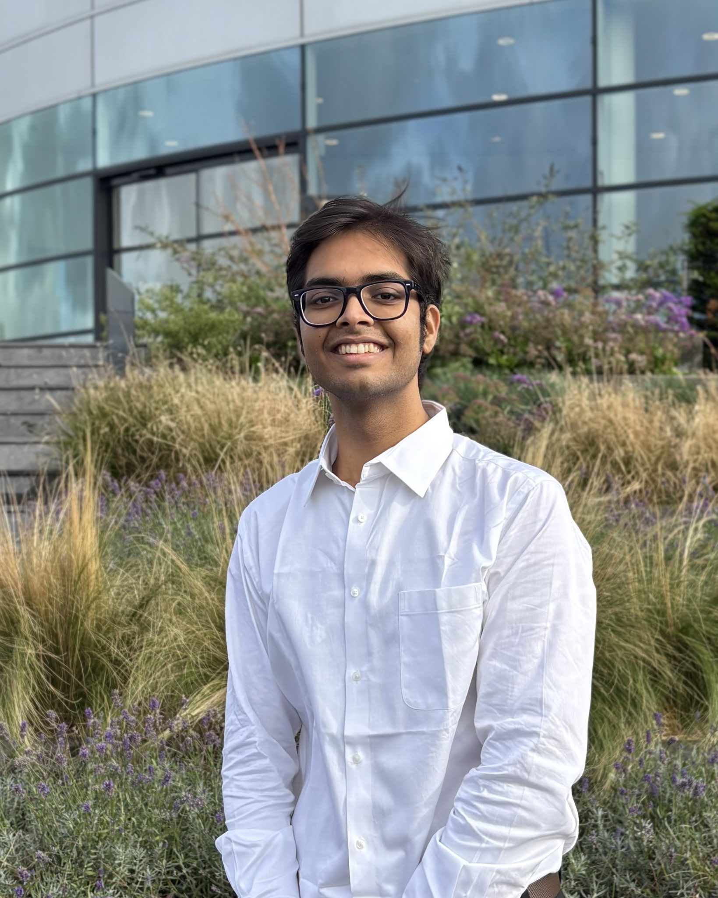

# Hello 👋

<!-- [Example_image](/static/profile_pic.png) -->

**Welcome to my portfolio website**

I'm currently doing my Masters in Robotics at TUDelft. Prior to joining the masters program, I was working as a Pre-Doctoral Fellow at [RBCCPS, IISc](https://cps.iisc.ac.in/) under Prof. [Ravi Prakash](https://ravipr009.github.io). I worked as a Research Assistant at [Robotics Research Center](https://robotics.iiit.ac.in/), IIIT Hyderabad advised by Prof. [K Madhava Krishna](https://faculty.iiit.ac.in/~mkrishna/), Prof. [Mohan Sridharan](https://homepages.inf.ed.ac.uk/msridhar/), and Dr. [Krishna Murthy Jatavallabhula](https://krrish94.github.io/). Previously, I have worked under Prof. [Shishir Kolathaya](https://www.shishirny.com/) at IISc on building mechanical structures for quadruped, Prof. [Faruk Kazi](https://in.linkedin.com/in/dr-faruk-kazi-vjti) at VJTI on developing an Industrial Robot capable of solving the problem of bin packing. My research interests are in the domain of Manipulation, Planning, Learning and Soft Robotics. I wish to delve deeper into combining Dynamical Systems and RL for Long-Horizon Manipulation task. My past research works focused on developing low-cost, simplistic gripper for In-Hand Manipulation, Collaborative cost reduction in the domain of Human-Robot Collaboration for household tasks. 

## News

* <b>09/2025:</b> Commenced Masters in Robotics at TU Delft.

* <b>01/2025:</b> AdaptBot framework for Knowledge refinement and expansion paper accepted at [ICRA 2025](https://2025.ieee-icra.org/)

* <b>01/2025:</b> Joined RBCCPS, IISc as a Pre-Doc Fellow 

* <b>09/2024:</b> Paper on framework for Knowledge expansion of a robot in a household setting submitted at [ICRA 2025](https://2025.ieee-icra.org/)

* <b>07/2024:</b> DaTAPlan Framework paper accepted and presented in [RSS 2024 Task Specification Workshop](https://sites.google.com/view/rss-taskspec)

* <b>07/2024:</b> Delivered a "Spotlight" Talk for In-Hand Manipulator work at [RSS 2024 Dexterous Manipulation Workshop](https://dex-manipulation.github.io/rss2024)

* <b>06/2024:</b> Reviewed 2 papers for [RSS 2024 Task Specification Workshop](https://sites.google.com/view/rss-taskspec)

* <b>05/2024:</b> Accepted as an Inclusion Fellow at [Inclusion@RSS 2024](https://roboticsconference.org/program/inclusion/)

* <b>04/2024:</b> Acti-V-Link In-hand Manipulator paper accepted at [ACM RobCE 2024](https://www.robce.org/)

<!-- * <b>04/2024:</b> DaTAPlan Framework paper accepted in [Cooking Robotics Workshop](https://sites.google.com/view/icra2024cookingrobotics/accepted-works?authuser=0), ICRA 2024 -->

<!-- * <b>03/2024:</b> Paper on Task Anticipation by the robot in a Human-Robot Collaboration setting submitted at [IROS 2024](https://iros2024-abudhabi.org/) -->

* <b>02/2024:</b> Paper on Acti-V-Link In-hand manipulator gripper submitted at [ACM RobCE 2024](https://www.robce.org/)

* <b>01/2024:</b> Paper on Task Anticipated by the Agent in Household Environment accepted at [ICRA 2024](https://2024.ieee-icra.org/)

* <b>10/2023:</b> Article on a soft robot traversing pipeline accepted at [Everything About Water Magazine(August 2023)](https://www.eawater.com/emagazine/)

* <b>09/2023:</b> Submitted the paper on Task Anticipation at ICRA 2024

* <b>06/2023:</b> Bachelors thesis defense

* <b>02/2023:</b> Finalist at the IEEE Robosoft 2023 Competition for "In-pipe locomotion" challenge
